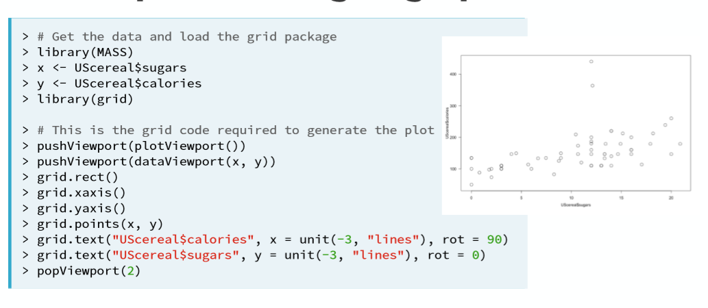
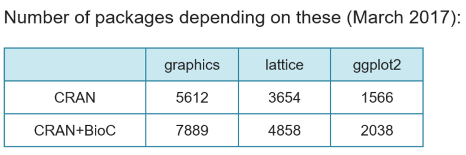

```{r setup, include=FALSE}
knitr::opts_chunk$set(echo = FALSE)
library(corrplot)
library(MASS)
library(htmltools)
library(dplyr)
library(tibble)
library(ggplot2)
library(plotly)
library(lattice)
library(latticeExtra)
# library(mlmRev)
options(tibble.print_max = 15)
options(tibble.print_min = 6)
```

```{css firstpagebg, echo=FALSE}
.title-slide {
  background-size: cover;
  background-position: center;
  background-blend-mode: lighten;
  text-align: left;
  
}
```

## {.flexbox .vcenter}
<div class="gray3">
<font size="7">
<div class = "centered">
Pourquoi faire le choix de r&eacute;aliser ses graphiques sous R ?
</div>
</font>
</div>  

## {.flexbox .vcenter}


## {.flexbox .vcenter}


## **Visualiser ses donn&eacute;es avec R** {data-background=images/feuille_outils2.jpg data-background-size=cover .bigger .flexbox .vcenter}

<div class="black" >
<font size="6.6">

- Les 4 syst&egrave;mes graphiques en `R`

- Quelle strat&eacute;gie adopter pour repr&eacute;senter mes donn&eacute;es ?

</font>
</div>


## Ce que nous allons faire {data-background=images/dataviz_dessin.jpg data-background-size=cover .bigger .flexbox .vcenter}

<div class="black" >
<font size="6.6"> 

- D&eacute;tailler les <div class="blue" >logiques de synthaxe </div> 
   
- D&eacute;tailler les <div class="blue" >options de personnalisation</div> 

- Strat&eacute;gie de mise en oeuvre rapide  


</font>
</div>  

## Ce que nous n'aborderons pas {data-background=images/temps.jpg data-background-size=auto .bigger .flexbox .vcenter}   
<div class="black" >
<font size="6.6"> 

- Cartographie  

- Construction de graphiques anim&eacute;s   

- Construction d'applications

</font>
</div>


## {.flexbox .vcenter}
<div class="gray3">
<font size="7">
<div class = "centered">
Comment &ecirc;tre efficace - construire mon graphique
</div>
</font>
</div>

## Comment &ecirc;tre efficace - construire mon graphique

Nous allons aborder la r&eacute;alisation de graphique en 4 &eacute;tapes :

1. Conna&icirc;tre les 4 syst&egrave;mes graphiques  

2. Les options de personnalisations  

3. Les r&egrave;gles s&eacute;miologie graphique / bonnes pratiques  

4. Utiliser des outils d'autres disciplines pour &ecirc;tre plus efficace 


## Visualiser mes donn&eacute;es 

    


## Visualiser mes donn&eacute;es


## {.flexbox .vcenter}
<div class="gray3">
<font size="7">
<div class = "centered">
Les 4 syst&egrave;mes graphiques sous `R`
</div>
</font>
</div>

## Les 4 syst&egrave;mes graphiques  

- *`Base graphics` :* le plus simple &agrave; apprendre  
- *`Grid graphics` :* ensemble de modules puissants pour construire d'autres outils  
- *`Lattice graphics` :* syst&egrave;me &agrave; caract&egrave;re g&eacute;n&eacute;ral bas&eacute; sur `Grid`. logique `trellis graphics` (Cleveland)  
- *`ggplot2` :* bas&eacute; sur *"grammar of graphics"*


## {data-background=images/feuille_base.jpg data-background-size=cover .flexbox .vcenter}
<div class="gray3">
<font size="7">
<div class = "centered">
`Base graphics`
</div>
</font>
</div>

## Le plus simple &agrave; manipuler 

### En phase d'exploration  

```{r, eval=TRUE,echo=TRUE}  
graphics::plot(ChickWeight)
```

## Le plus simple &agrave; manipuler

### En phase d'exploration  

```{r, eval=TRUE,echo=TRUE}  
graphics::plot(ChickWeight$weight)
```

## `Sunflowerplot`

```{r, eval=TRUE,echo=FALSE}
par(mfrow = c(1,2))
plot(Boston$rad, Boston$tax, main ="plot")
sunflowerplot(Boston$rad, Boston$tax, main ="Sunflowerplot")
```


## Autres graphiques de base

- `boxplot`
- `mosaic plot`  

```{r,echo=FALSE,eval=TRUE}
mosaicplot(cyl ~ gear, mtcars, main = "Mosaicplot")
```

## Logique de construction

Les graphiques `R` de base peuvent &ecirc;tre construits gr&acirc;ce &agrave; deux types de fonctions :  

- `fonctions de haut niveau`    
    + exemple :`plot()`

- `fonctions de bas niveau `    
    + pour ajouter des caract&eacute;ristiques au graphique  
    + `lines()`  
    + `text()`
    + `points()`
    
## La fonction `par()`  

- Utilis&eacute;e pour le *facettage*

```{r,echo=TRUE,eval=FALSE}

par(mfrow = c(1,2))
```

Affichage : 

- 1 ligne   
- 2 colonnes

## La fonction `par()`  

```{r,echo=TRUE,eval=FALSE}
par(mfrow = c(2, 3))
```

```{r}
old_options <- par(mfrow = c(2, 3))
plot(mpg$cty, mpg$hwy)
hist(mpg$cty)
plot(density(mpg$cty))
plot(table(mpg$fl))
barplot(table(mpg$fl))
plot(table(mpg$fl, mpg$drv))
par(old_options)
```

## Des graphiques avanc&eacute;s  

`bagplot()` : [exemples](https://datavizproject.com/data-type/bagplot/) 


## {data-background=images/feuille_grid.jpg data-background-size=auto .flexbox .vcenter}
<div class="gray3">
<font size="7">
<div class = "centered">
`Grid graphics`
</div>
</font>
</div>


## `Grid graphics`



## {data-background=images/feuille.jpg data-background-size=cover .flexbox .vcenter}
<div class="gray3">
<font size="7">
<div class = "centered">
`Le package lattice`
</div>
</font>
</div>


## Le package `lattice`

### Bas&eacute; sur "Trellis graphics" (Cleveland)


## Les packages bas&eacute; sur chaque syst&egrave;me



## Le package `lattice `  

### But le plus important du package  

- R&eacute;aliser des packages conditionnels  
    + efficace pour d&eacute;tecter les sources de variabilit&eacute; d'un ph&eacute;nom&egrave;ne   
    + Comparaison entre diff&eacute;rent sous-groupe de donn&eacute;es  


## Le package `lattice `

"
- use high-level functions such as `histogram()`, `xyplot()` ...   
- optional arguments for common variants   
- But it's not possible to anticipate all variants   
- Need some system to design next visualizations    

"


*Deepayan Sarkar*

## Les arguments des fonctions de `lattice`  

- Obligatoires
    + `~ x` : premier argument   
    + `data` : le dataset qui contient les variables  
    
- Optionnels    
    + certains sont communs &agrave; toutes les fonctions   
    + certains sont sp&eacute;cifiques &agrave; certaines fonctions  


## package `lattice `

On retrouve les graphiques usuels de `Base`

```{r , echo=TRUE,eval=TRUE,warning=FALSE}
histogram( ~ wt, data = mtcars)
```

(nb : `percent` et pas `freq`)

## "trellis" object

Le package permet de cr&eacute;er des objets qui pourront &ecirc;tre appel&eacute;s. 

```{r, echo=TRUE}
tplot <- densityplot(~rate.male + rate.female,
                     data = USCancerRates, outer = T)

class(tplot)
```

## "trellis" object

```{r, echo=TRUE, collapse = TRUE, include=T}
tplot <- densityplot(~rate.male + rate.female | state,
                     data = USCancerRates, outer = T)
head(summary(tplot)[[2]])
```

## "trellis" object

Il faut voir cet objet comme un `array`

```{r, echo=TRUE, collapse = TRUE, include=T}
tplot <- densityplot(~rate.male + rate.female | state,
                     data = USCancerRates, outer = T)
dim(tplot)
```


## "trellis" object

On peut ensuite mettre &agrave; jour un argument gr&acirc;ce &agrave; la fonction `update()`


## Fonction panel

Pour r&eacute;liser des visualisations, pas possible d'anticiper toutes les variantes.
Par exemple, 
histogramme + kernel density en m&ecirc;me temps

## avec le package `base`

```{r,echo=TRUE,eval=TRUE}

data(USCancerRates, package = "latticeExtra")
log.r.m <- log(USCancerRates$rate.male)
hist(log.r.m, freq = F)
lines(density(log.r.m,na.rm = T), col = "green")
```


## avec le package `lattice`

Il faut créer une fonction `panel`
```{r,echo=TRUE,eval=FALSE}
panel.histdens <- function(x, ...){
  panel.histogram(...)
  panel.lines(density(x,na.rm = T))
}
```

## avec le package `lattice`

```{r,echo=TRUE,eval=T}
panel.histdens <- function(x, ...){
  panel.histogram(x,...)
  panel.lines(density(x,na.rm = T))
}

histogram(~rate.female + rate.male, USCancerRates,
          type = "density", layout = c(1,2),
          panel = panel.histdens)

```

## {data-background=images/feuille.jpg data-background-size=cover .flexbox .vcenter}
<div class="gray3">
<font size="7">
<div class = "centered">
`Le package ggplot2`
</div>
</font>
</div>

## Le package `ggplot2` 

### Pourquoi il est int&eacute;ressant de conna&icirc;tre la synthaxe de ce package ?
<br></br>  

> - bas&eacute; sur *"the grammar of graphics"*  
> - &eacute;cosyst&egrave;me riche : beaucoup de packages reprennent la logique de `ggplot2`  
> - un package du `tidyverse`

## *Grammar of graphics*  


## Grammar of graphics {data-background=images/livre_W.png data-background-size=auto}

<div class = black>
"The Grammar of Graphics"" de Leland Wilkinson a eu une influence importante sur la façon de penser les graphes  
<br></br>
<br></br>  
2 principes 
<ul> 
<br></br>
    <li> Graphique = différentes couches d’&eacute;l&eacute;ments grammaticaux </li>   
<li>Des graphiques signifiants respectant des r&egrave;gles math&eacute;matiques et esth&eacute;tiques</li>
</ul> 
</div>

## Le package `ggplot2` 

- Le package ggplot2  permet la r&eacute;alisation de graphiques directement &agrave; partir d’un fichier d&eacute;tail, d’un fichier détail pond&eacute;r&eacute;, ou de donn&eacute;es agr&eacute;g&eacute;es   
    + On initialise un graphique
    + On y ajoute des calques   
    
  

## El&eacute;ments essentiels de la grammaire   

  

## Tous les &eacute;l&eacute;ments de la grammaire  


## ...on peut y ajouter d'autres couches  
> - scales : l’&eacute;chelle des axes (lin&eacute;aire, logarithmique, &agrave; l’envers), les couleurs de remplissage   
> - ggtitle(" ") : ajoute un titre principal au graphique   
> - xlab(" ") : change le libell&eacute; des abscisses   
> - ylab(" ") : change le libell&eacute; des ordonn&eacute;es   
> - labs( title = " ", x = " ", y = " ") : modifie titre principal, libell&eacute; des abscisses, libell&eacute; des ordonn&eacute;es en une seule fonction   
> - etc.


## Comment je construis mon graphique avec `ggplot2` ? 

1. J'initialise mon graphique    
    + Deux fonctions pour le faire : `qplot()` et `ggplot()`
    
2. Chaque &eacute;l&eacute;ment s'ajoute &agrave; un autre par le symbole +


## Comment je construis mon graphique avec `ggplot2` ?
```{r, echo=TRUE,fig.height=3,fig.width=5}

library(ggplot2)
ggplot(data = mtcars)+
  geom_point(mapping = aes(x = mpg, y = hp))

```


## Une solution clique-bouton 

### Id&eacute;ale lors des phases exploratoires
    
    
Le package `esquisse`

```{r,eval=FALSE,echo=TRUE}
install.packages("esquisse")
library(esquisse)

```

[Site GitHub DreamRs](https://github.com/dreamRs/esquisse) 

https://www.dreamrs.fr/


## Un package *helper* : `corrplot`

```{r, echo=TRUE,eval=F}
library(corrplot)
```

```{r,echo=TRUE, eval = TRUE, warning=FALSE,fig.height=3,fig.width=5}  
correlation <- cor(mtcars)
# Fonction du package corrplot
corrplot(correlation,method = "ellipse")

```


## {.flexbox .vcenter}
<div class="gray3">
<font size="7">
<div class = "centered">
R&egrave;gles de datavisualisation
</div>
</font>
</div>


## Avoir les bons r&eacute;flexes

1. Une communaut&eacute; riche  
    +   
    + `ROpenSci`  
    + Communaut&eacute; Slack Grrr
    + Ressources en fran&ccedil;ais : [frrrenchies](https://github.com/frrrenchies/frrrenchies)
    + etc.
    
2. Regarder ce que font d'autres acteurs de la visualisation de la donn&eacute;e    
    + UI/UX design   
    + Webdesign   
    + Cartographie / g&eacute;omatique  
    + etc.


## Des sites pour se souvenir des bonnes pratiques 

[From Data to Viz](https://www.data-to-viz.com/index.html#about)

Un article int&eacute;ressant : [Interview C.Bontemps](https://urfistinfo.hypotheses.org/3252
)

## {.flexbox .vcenter}
<div class="gray3">
<font size="7">
<div class = "centered">
Des graphiques interactifs : une introduction
</div>
</font>
</div>

## Le package `plotly`

- Permet de rendre un graphique `ggplot2` interactif. 

- Peut &ecirc;tre utilis&eacute; seul pour des options de customisation plus avanc&eacute;e

- [Un site pour trouver des bons exemples pour d&eacute;buter](https://plot.ly/r/)


## Le package `plotly`

```{r, echo = TRUE, eval = TRUE}
library(dplyr)
mtcars %>% 
  ggplot(aes(x = mpg, y = disp, color = factor(cyl))) +   geom_point() 

```

## Le package `plotly`

```{r, echo = FALSE, eval = TRUE}
library(dplyr)
p <- mtcars %>% 
  ggplot(aes(x = mpg, y = disp, color = factor(cyl))) +   geom_point()

ggplotly(p)

```


## Autre package d'int&eacute;ractivit&eacute; facile à prendre en main  


## Les diff&eacute;rents types de graphiques 

- statiques
- interactifs
- dynamiques / anim&eacute;s


## {.flexbox .vcenter}
<div class="gray3">
<font size="7">
<div class = "centered">
Trouver rapidement des outils de personnalisation
</div>
</font>
</div>  


## Outils pour g&eacute;rer la couleur

### Cartographie

(https://neocarto.hypotheses.org/1458)

### Autres ressources

(https://coolors.co/) g&eacute;n&eacute;rateur de palette de couleur
(http://chir.ag/projects/name-that-color/#ED616A) nommer la couleur  
(http://colorbrewer2.org/#type=sequential&scheme=BuGn&n=3) site ColorBrewer

(https://flatuicolors.com/) Choisir une couleur


## {.flexbox .vcenter}
<div class="gray3">
<font size="7">
<div class = "centered">
R&eacute;capitulatif
</div>
</font>
</div> 

## 2 approches standards

- D&eacute;claratives    
    + On fournit un ensemble de sp&eacute;cifications  
    + Le syst&egrave;me d&eacute;cide comment respecter au mieux ces demandes 
    + C'est l'approche utilis&eacute;e par `ggplot2`  
    
- Proc&eacute;ral ou algorithmique  
    + On fournit un ensemble d'instructions   
    + Elles sont ex&eacute;cut&eacute;s de mani&egrave;re s&eacute;quentielle 
    + C'est l'approche `base R graphics` et `lattice`

## Exemples de dataviz 

[Exemples de datavisualisation](https://uxplanet.org/functional-visualization-vs-artistic-dashboarding-8764cc117aa9)

[Exemples originaux de dataviz et musique](https://towardsdatascience.com/data-visualization-in-music-11fcd702c893)


